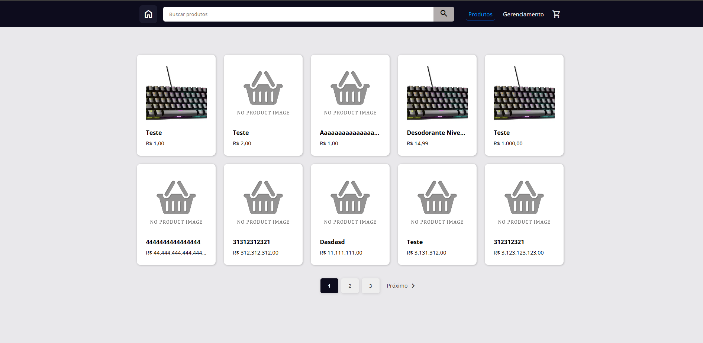
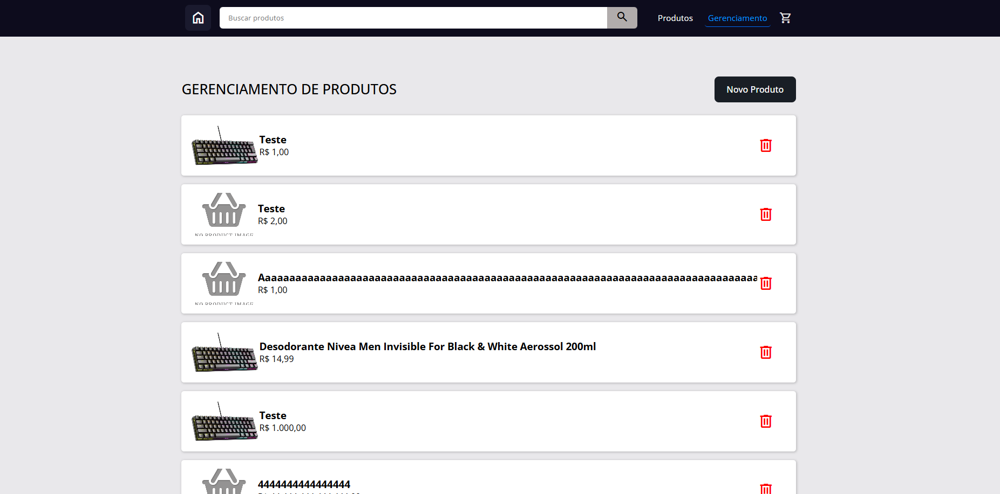
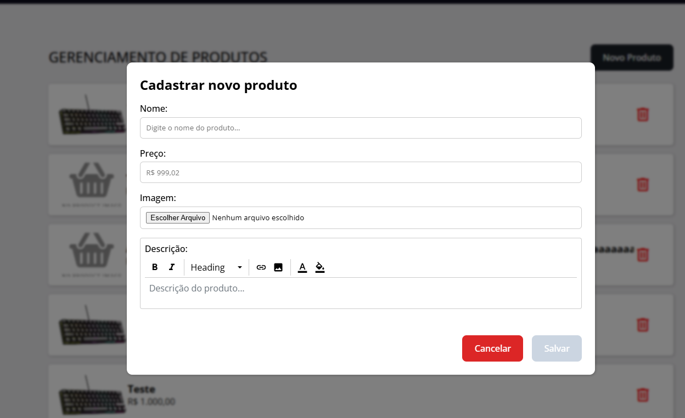
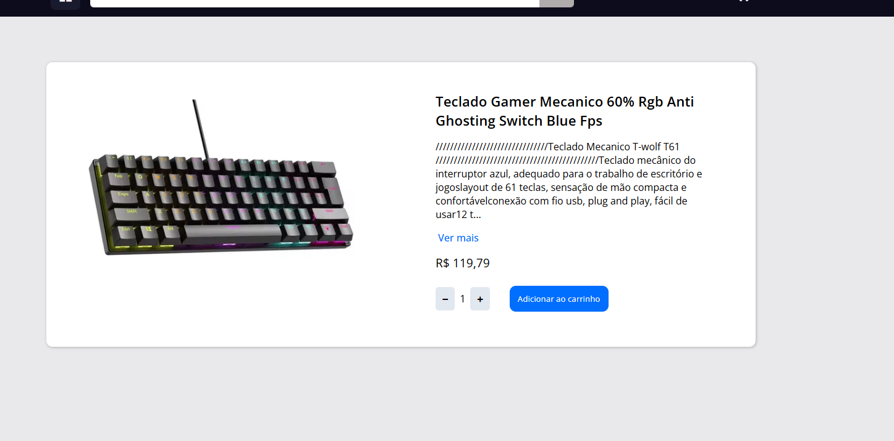
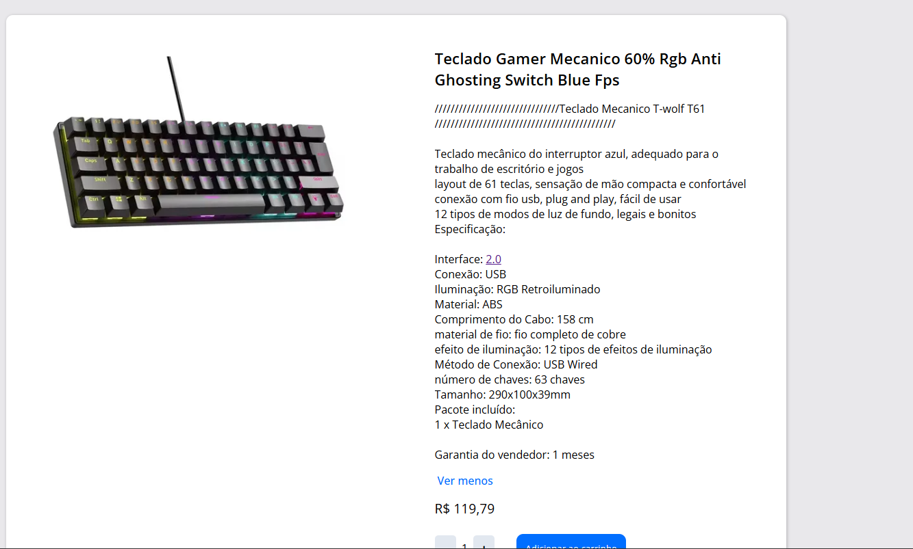
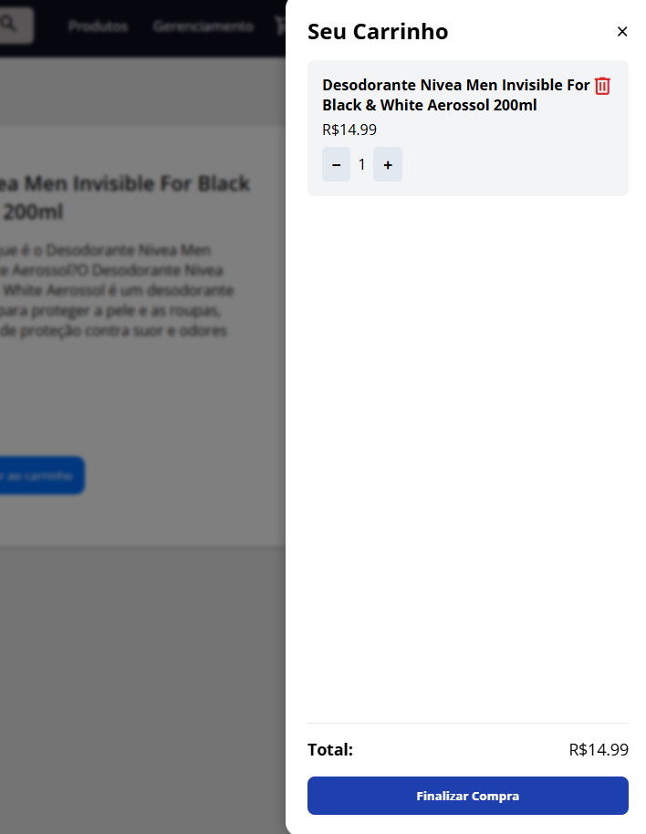
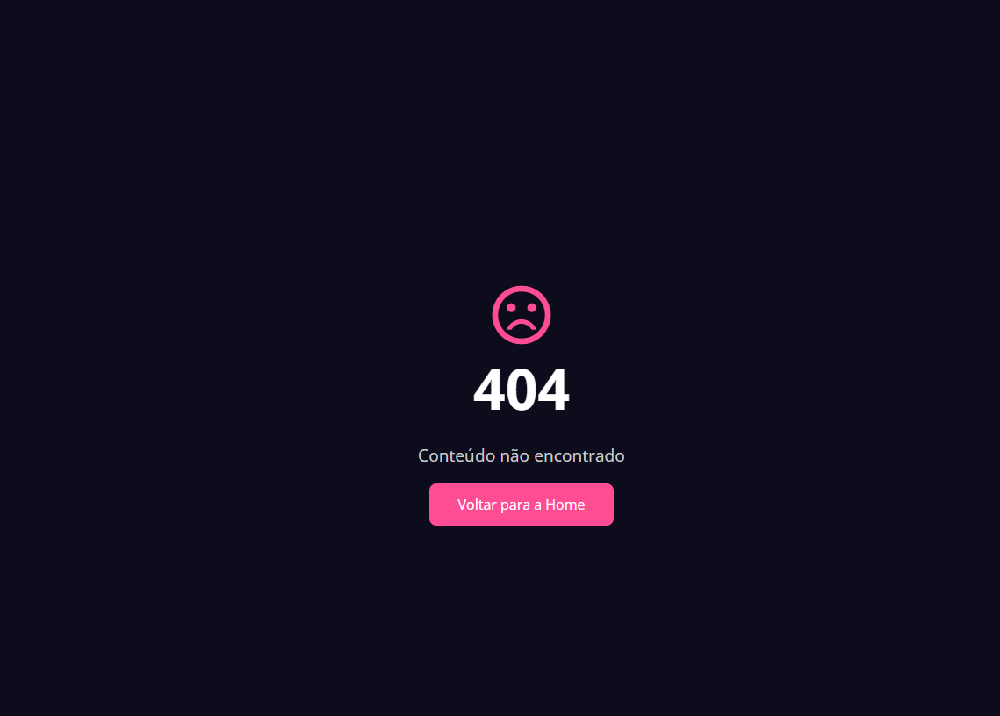

## O que preciso fazer para rodar o projeto?

### Backend

Utilizando o Node, será necessário seguir as seguintes etapas:

1. Instalar o NodeJs na sua máquina.

2. Configurar as variáveis de ambiente no arquivo .env do projeto:

```sh
## Server
PORT=3000
APP_URL=http://localhost:3000
PRODUCT_UPLOAD_PATH=public/uploads/product
FRONTEND_URL=http://localhost:4200

## Database
PGHOST="localhost"
PGDATABASE="products"
PGUSER="postgres"
PGPASSWORD="postgres"
PGPORT=5432
```

3. Instalar as dependências, e executar o projeto:

```sh
npm install

npx run start:dev
```

### Frontend

Utilizando o Node, será necessário seguir a seguinte etapa:

1. Instalar as dependências, e executar o projeto:

```sh
npm install

npx run start
```

## Projeto Online
A aplicação está disponível em:

🔗 https://product-test-management.netlify.app/

Detalhes Técnicos
Frontend: Angular, hospedado no Netlify

Backend: NestJS, hospedado no Render

Banco de dados: PostgreSQL (Render)

⚠️ Observações Importantes
Inicialização demorada: O servidor backend (e o banco) entram em estado de suspensão no Render após um tempo de inatividade. Por isso, a primeira requisição pode demorar alguns segundos.

Imagens temporárias: Como o Render não oferece armazenamento persistente de arquivos, as imagens são apagadas automaticamente após um tempo.

## Telas: 













